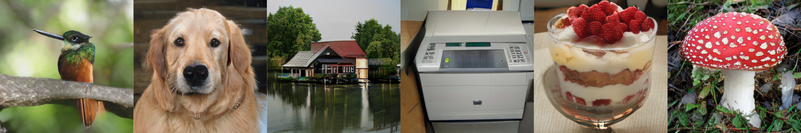
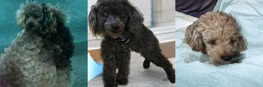
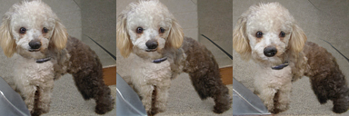
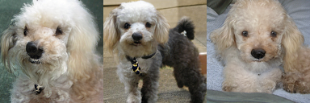
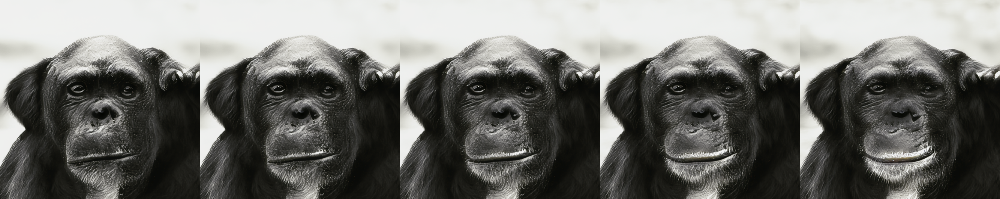

#### [[Project]](https://sites.google.com/view/stylegan-xl/)    [[PDF]](https://arxiv.org/abs/2202.00273)    [](https://huggingface.co/spaces/hysts/StyleGAN-XL)


This repository contains code for our SIGGRAPH'22 paper "StyleGAN-XL: Scaling StyleGAN to Large Diverse Datasets"

by [Axel Sauer](https://axelsauer.com/), [Katja Schwarz](https://katjaschwarz.github.io/), and [Andreas Geiger](http://www.cvlibs.net/).


If you find our code or paper useful, please cite
```bibtex
@InProceedings{Sauer2021ARXIV,
  author    = {Axel Sauer and Katja Schwarz and Andreas Geiger},
  title     = {StyleGAN-XL: Scaling StyleGAN to Large Diverse Datasets},
  journal   = {arXiv.org},
  volume    = {abs/2201.00273},
  year      = {2022},
  url       = {https://arxiv.org/abs/2201.00273},
}
```

|Rank on Papers With Code|  &nbsp;
 :---  |  :---
 [](https://paperswithcode.com/sota/image-generation-on-imagenet-32x32?p=stylegan-xl-scaling-stylegan-to-large-diverse)|[](https://paperswithcode.com/sota/image-generation-on-cifar-10?p=stylegan-xl-scaling-stylegan-to-large-diverse)
[](https://paperswithcode.com/sota/image-generation-on-imagenet-64x64?p=stylegan-xl-scaling-stylegan-to-large-diverse)|[](https://paperswithcode.com/sota/image-generation-on-ffhq-256-x-256?p=stylegan-xl-scaling-stylegan-to-large-diverse)
[](https://paperswithcode.com/sota/image-generation-on-imagenet-128x128?p=stylegan-xl-scaling-stylegan-to-large-diverse)|[](https://paperswithcode.com/sota/image-generation-on-ffhq?p=stylegan-xl-scaling-stylegan-to-large-diverse)
[](https://paperswithcode.com/sota/image-generation-on-imagenet-256x256?p=stylegan-xl-scaling-stylegan-to-large-diverse)|[](https://paperswithcode.com/sota/image-generation-on-pokemon-256x256?p=stylegan-xl-scaling-stylegan-to-large-diverse)
[](https://paperswithcode.com/sota/image-generation-on-imagenet-512x512?p=stylegan-xl-scaling-stylegan-to-large-diverse)|[](https://paperswithcode.com/sota/image-generation-on-pokemon-1024x1024?p=stylegan-xl-scaling-stylegan-to-large-diverse)

## Related Projects ##
- Projected GANs Converge Faster (NeurIPS'21) &nbsp;-&nbsp; [Official Repo](https://github.com/autonomousvision/projected_gan) &nbsp;-&nbsp; [](https://colab.research.google.com/gist/xl-sr/757757ff8709ad1721c6d9462efdc347/projected_gan.ipynb)
- StyleGAN-XL + CLIP (Implemented by CasualGANPapers) &nbsp;-&nbsp;  [](https://colab.research.google.com/github/CasualGANPapers/unconditional-StyleGANXL-CLIP/blob/main/StyleganXL%2BCLIP.ipynb)
- StyleGAN-XL + CLIP (Modified by Katherine Crowson to optimize in W+ space) &nbsp;-&nbsp; [](https://colab.research.google.com/drive/1ZEnJE-EUnh-aCXJbu0kVhi8_Qdi2BV-S)

## Requirements ##
- 64-bit Python 3.8 and PyTorch 1.9.0 (or later). See https://pytorch.org for PyTorch install instructions.
- CUDA toolkit 11.1 or later.
- GCC 7 or later compilers. The recommended GCC version depends on your CUDA version; see for example, CUDA 11.4 system requirements.
- If you run into problems when setting up the custom CUDA kernels, we refer to the [Troubleshooting docs](https://github.com/NVlabs/stylegan3/blob/main/docs/troubleshooting.md#why-is-cuda-toolkit-installation-necessary) of the original StyleGAN3 repo and the following issues: https://github.com/autonomousvision/stylegan_xl/issues/23.
- Windows user struggling installing the env might find https://github.com/autonomousvision/stylegan_xl/issues/10
  helpful.
- Use the following commands with Miniconda3 to create and activate your PG Python environment:
  - ```conda env create -f environment.yml```
  - ```conda activate sgxl```

## Data Preparation ##
For a quick start, you can download the few-shot datasets provided by the authors of [FastGAN](https://github.com/odegeasslbc/FastGAN-pytorch). You can download them [here](https://drive.google.com/file/d/1aAJCZbXNHyraJ6Mi13dSbe7pTyfPXha0/view). To prepare the dataset at the respective resolution, run
```
python dataset_tool.py --source=./data/pokemon --dest=./data/pokemon256.zip \
  --resolution=256x256 --transform=center-crop
```

You need to follow our progressive growing scheme to get the best results. Therefore, you should prepare separate zips for each training resolution. You can get the datasets we used in our paper at their respective websites ([FFHQ](https://github.com/NVlabs/ffhq-dataset), [ImageNet](https://image-net.org/)).

## Training ##


For progressive growing, we train a stem on low resolution, e.g., 16<sup>2</sup> pixels. When the stem is finished, i.e., FID is saturating, you can start training the upper stages; we refer to these as superresolution stages.

#### Training the stem

Training StyleGAN-XL on Pokemon using 8 GPUs:

```
python train.py --outdir=./training-runs/pokemon --cfg=stylegan3-t --data=./data/pokemon16.zip \
    --gpus=8 --batch=64 --mirror=1 --snap 10 --batch-gpu 8 --kimg 10000 --syn_layers 10
```
```--batch``` specifies the overall batch size, ```--batch-gpu``` specifies the batch size per GPU. The training loop will automatically accumulate gradients if you use fewer GPUs until the overall batch size is reached.

Samples and metrics are saved in ```outdir```. If you don't want to track metrics, set ```--metrics=none```. You can inspect fid50k_full.json or run tensorboard in ```training-runs/``` to monitor the training progress.

For a class-conditional dataset (ImageNet, CIFAR-10), add the flag ```--cond True ```. The dataset needs to contain the class labels; see the [StyleGAN2-ADA repo](https://github.com/NVlabs/stylegan2-ada-pytorch) on how to prepare class-conditional datasets.

#### Training the super-resolution stages
Continuing with pretrained stem:
```
python train.py --outdir=./training-runs/pokemon --cfg=stylegan3-t --data=./data/pokemon32.zip \
  --gpus=8 --batch=64 --mirror=1 --snap 10 --batch-gpu 8 --kimg 10000 --syn_layers 10 \
  --superres --up_factor 2 --head_layers 7 \
  --path_stem training-runs/pokemon/00000-stylegan3-t-pokemon16-gpus8-batch64/best_model.pkl
```

```--up_factor``` allows to train several stages at once, i.e., with ```--up_factor=4``` and a 16<sup>2</sup> stem you can directly train at resolution  64<sup>2</sup>.

If you have enough compute, a good tactic is to train several stages in parallel and then restart the superresolution stage training once in a while. The current stage will then reload its previous stem's ```best_model.pkl```. Performance can sometimes drop at first because of domain shift, but the superresolution stage quickly recovers and improves further.

#### Training recommendations for datasets other than ImageNet
The default settings are tuned for ImageNet. For smaller datasets (<50k images) or well-curated datasets (FFHQ), you can significantly decrease the model size enabling much faster training. Recommended settings are: ```--cbase 16384 --cmax 256 --syn_layers 7``` and for superresolution stages ```--head_layers 4```.

Suppose you want to train as few stages as possible. We recommend training a 32x32 or 64x64 stem, then directly scaling to the final resolution (as described above, you must adjust ```--up_factor``` accordingly). However, generally, progressive growing yields better results faster as the throughput is much higher at lower resolutions. This can be seen in this figure by [Karras et al., 2017](https://arxiv.org/abs/1710.10196):

<p align="center">
  
</p>


## Generating Samples & Interpolations ##


To generate samples and interpolation videos, run
```
python gen_images.py --outdir=out --trunc=0.7 --seeds=10-15 --batch-sz 1 \
  --network=https://s3.eu-central-1.amazonaws.com/avg-projects/stylegan_xl/models/pokemon256.pkl
```
and
```
python gen_video.py --output=lerp.mp4 --trunc=0.7 --seeds=0-31 --grid=4x2 \
  --network=https://s3.eu-central-1.amazonaws.com/avg-projects/stylegan_xl/models/pokemon256.pkl
```
For class-conditional models, you can pass the class index via ```--class```, a index-to-label dictionary for Imagenet can be found [here](https://github.com/autonomousvision/stylegan_xl/blob/main/media/imagenet_idx2labels.txt). For interpolation between classes, provide, e.g., ```--cls=0-31``` to  ```gen_video.py```. The list of classes has to be the same length as ```--seeds```.

To generate a conditional sample sheet, run
```
python gen_class_samplesheet.py --outdir=sample_sheets --trunc=1.0 \
  --network=https://s3.eu-central-1.amazonaws.com/avg-projects/stylegan_xl/models/imagenet128.pkl \
  --samples-per-class 4 --classes 0-32 --grid-width 32
```

For ImageNet models, we enable multi-modal truncation (proposed by [Self-Distilled
GAN](https://self-distilled-stylegan.github.io/)). We generated 600k find 10k cluster centroids via k-means. For a given samples, multi-modal truncation finds the closest centroids and interpolates towards it. To switch from uni-model to multi-modal truncation, pass

<sub>`--centroids-path=https://s3.eu-central-1.amazonaws.com/avg-projects/stylegan_xl/models/imagenet_centroids.npy`</sub><br>

|No Truncation| Uni-Modal Truncation | Multi-Modal Truncation
:---  |  :---:  |  :---:
 | | 

## Image Inversion ##
<p align="center">
  
</p>

To invert a given image via latent optimization, and optionally use our reimplementation of [Pivotal Tuning Inversion](https://arxiv.org/abs/2106.05744), run

```
python run_inversion.py --outdir=inversion_out \
  --target media/jay.png \
  --inv-steps 1000 --run-pti --pti-steps 350 \
  --network=https://s3.eu-central-1.amazonaws.com/avg-projects/stylegan_xl/models/imagenet512.pkl
```

Provide an image via ```target```, it is automatically resized and center-cropped to match the generator network. You do not need to provide a class for ImageNet models, we infer the class of a given sample via a pretrained classifier.

## Image Editing ##


To use our reimplementation of [StyleMC](https://arxiv.org/abs/2112.08493), and generate the example above, run

```
python run_stylemc.py --outdir=stylemc_out \
  --text-prompt "a chimpanzee | laughter | happyness| happy chimpanzee | happy monkey | smile | grin" \
  --seeds 0-256 --class-idx 367 --layers 10-30 --edit-strength 0.75 --init-seed 49 \
  --network=https://s3.eu-central-1.amazonaws.com/avg-projects/stylegan_xl/models/imagenet128.pkl \
  --bigger-network https://s3.eu-central-1.amazonaws.com/avg-projects/stylegan_xl/models/imagenet1024.pkl
```

Recommended workflow:

- Sample images via ```gen_images.py```.
- Pick a sample and use it as the inital image for ```stylemc.py``` by providing ```--init-seed``` and ```--class-idx```.
- Find a direction in style space via ```--text-prompt```.
- Finetune ```--edit-strength```, ```--layers```, and amount of ```--seeds```.
- Once you found a good setting, provide a larger model via ```--bigger-network```. The script still optimizes the direction for the smaller model, but uses the bigger model for the final output.

## Pretrained Models ##

We provide the following pretrained models (pass the url as `PATH_TO_NETWORK_PKL`):

|Dataset| Res | FID | PATH
 :---  |  ---:  |  ---:  | :---
ImageNet| 16<sup>2</sup>   |0.73|  <sub>`https://s3.eu-central-1.amazonaws.com/avg-projects/stylegan_xl/models/imagenet16.pkl`</sub><br>
ImageNet| 32<sup>2</sup>   |1.11|  <sub>`https://s3.eu-central-1.amazonaws.com/avg-projects/stylegan_xl/models/imagenet32.pkl`</sub><br>
ImageNet| 64<sup>2</sup>   |1.52|  <sub>`https://s3.eu-central-1.amazonaws.com/avg-projects/stylegan_xl/models/imagenet64.pkl`</sub><br>
ImageNet| 128<sup>2</sup>  |1.77|  <sub>`https://s3.eu-central-1.amazonaws.com/avg-projects/stylegan_xl/models/imagenet128.pkl`</sub><br>
ImageNet| 256<sup>2</sup>  |2.26|  <sub>`https://s3.eu-central-1.amazonaws.com/avg-projects/stylegan_xl/models/imagenet256.pkl`</sub><br>
ImageNet| 512<sup>2</sup>  |2.42|  <sub>`https://s3.eu-central-1.amazonaws.com/avg-projects/stylegan_xl/models/imagenet512.pkl`</sub><br>
ImageNet| 1024<sup>2</sup> |2.51|  <sub>`https://s3.eu-central-1.amazonaws.com/avg-projects/stylegan_xl/models/imagenet1024.pkl`</sub><br>
CIFAR10 | 32<sup>2</sup>   |1.85|  <sub>`https://s3.eu-central-1.amazonaws.com/avg-projects/stylegan_xl/models/cifar10.pkl`</sub><br>
FFHQ    | 256<sup>2</sup>  |2.19|  <sub>`https://s3.eu-central-1.amazonaws.com/avg-projects/stylegan_xl/models/ffhq256.pkl`</sub><br>
FFHQ    | 512<sup>2</sup>  |2.23|  <sub>`https://s3.eu-central-1.amazonaws.com/avg-projects/stylegan_xl/models/ffhq512.pkl`</sub><br>
FFHQ    | 1024<sup>2</sup> |2.02|  <sub>`https://s3.eu-central-1.amazonaws.com/avg-projects/stylegan_xl/models/ffhq1024.pkl`</sub><br>
Pokemon | 256<sup>2</sup>  |23.97| <sub>`https://s3.eu-central-1.amazonaws.com/avg-projects/stylegan_xl/models/pokemon256.pkl`</sub><br>
Pokemon | 512<sup>2</sup>  |23.82| <sub>`https://s3.eu-central-1.amazonaws.com/avg-projects/stylegan_xl/models/pokemon512.pkl`</sub><br>
Pokemon | 1024<sup>2</sup> |25.47| <sub>`https://s3.eu-central-1.amazonaws.com/avg-projects/stylegan_xl/models/pokemon1024.pkl`</sub><br>

## Quality Metrics ##
Per default, ```train.py``` tracks FID50k during training. To calculate metrics for a specific network snapshot, run

```
python calc_metrics.py --metrics=fid50k_full --network=PATH_TO_NETWORK_PKL
```

To see the available metrics, run
```
python calc_metrics.py --help
```

We provide precomputed FID statistics for all pretrained models:
```
wget https://s3.eu-central-1.amazonaws.com/avg-projects/stylegan_xl/gan-metrics.zip
unzip gan-metrics.zip -d dnnlib/
```

### Further Information
This repo builds on the codebase of [StyleGAN3](https://github.com/NVlabs/stylegan3) and our previous project [Projected GANs Converge Faster](https://github.com/autonomousvision/projected_gan).
