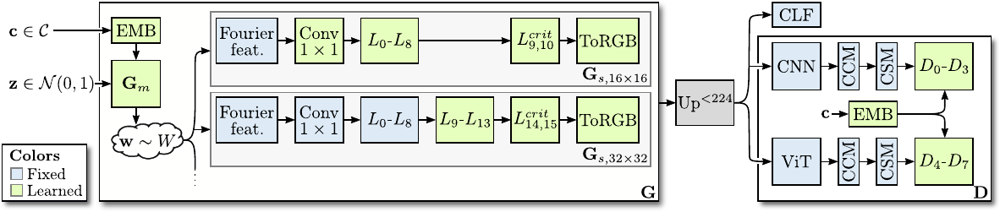

#### [[Project]](https://sites.google.com/view/stylegan-xl/)    [[PDF]](https://arxiv.org/abs/2202.00273)    [](https://huggingface.co/spaces/hysts/StyleGAN-XL)


This repository contains code for the paper "StyleGAN-XL: Scaling StyleGAN to Large Diverse Datasets"

by [Axel Sauer](https://axelsauer.com/), [Katja Schwarz](https://katjaschwarz.github.io/), and [Andreas Geiger](http://www.cvlibs.net/).


If you find our code or paper useful, please cite
```bibtex
@InProceedings{Sauer2021ARXIV,
  author    = {Axel Sauer and Katja Schwarz and Andreas Geiger},
  title     = {StyleGAN-XL: Scaling StyleGAN to Large Diverse Datasets},
  journal   = {arXiv.org},
  volume    = {abs/2201.00273},
  year      = {2022},
  url       = {https://arxiv.org/abs/2201.00273},
}
```

## ToDos
- [x] Initial code release
- [x] Add pretrained models (ImageNet{16,32,64,128}, FFHQ256, Pokemon256) 
- [ ] Add higher resolution models (ImageNet{256,512,1024})
- [ ] Add PTI for inversion
- [ ] Add StyleMC for editing

The higher resolution models are currently retraining with improved settings, weights will be gradually rolled out. Expected release of the ImageNet256 model is **14.04.2022**.

## Requirements ##
- 64-bit Python 3.8 and PyTorch 1.9.0 (or later). See https://pytorch.org for PyTorch install instructions.
- CUDA toolkit 11.1 or later.
- GCC 7 or later compilers. The recommended GCC version depends on your CUDA version; see for example, CUDA 11.4 system requirements.
- If you run into problems when setting up the custom CUDA kernels, we refer to the [Troubleshooting docs](https://github.com/NVlabs/stylegan3/blob/main/docs/troubleshooting.md#why-is-cuda-toolkit-installation-necessary) of the original StyleGAN3 repo.
- Use the following commands with Miniconda3 to create and activate your PG Python environment:
  - ```conda env create -f environment.yml```
  - ```conda activate sgxl```

## Data Preparation ##
For a quick start, you can download the few-shot datasets provided by the authors of [FastGAN](https://github.com/odegeasslbc/FastGAN-pytorch). You can download them [here](https://drive.google.com/file/d/1aAJCZbXNHyraJ6Mi13dSbe7pTyfPXha0/view). To prepare the dataset at the respective resolution, run
```
python dataset_tool.py --source=./data/pokemon --dest=./data/pokemon256.zip \
  --resolution=256x256 --transform=center-crop
```

You need to follow our progressive growing scheme to get the best results. Therefore, you should prepare separate zips for each training resolution. You can get the datasets we used in our paper at their respective websites ([FFHQ](https://github.com/NVlabs/ffhq-dataset), [ImageNet](https://image-net.org/)).

## Training ##



For progressive growing, we train a stem on low resolution, e.g., 16<sup>2</sup> pixels. When the stem is finished, i.e., FID is saturating, you can start training the upper stages; we refer to these as superresolution stages.

#### Training the stem

Training StyleGAN-XL on Pokemon using 8 GPUs:

```
python train.py --outdir=./training-runs/pokemon --cfg=stylegan3-t --data=./data/pokemon16.zip \
    --gpus=8 --batch=64 --mirror=1 --snap 10 --batch-gpu 8 --kimg 10000 --stem --syn_layers 10
```
```--batch``` specifies the overall batch size, ```--batch-gpu``` specifies the batch size per GPU. The training loop will automatically accumulate gradients if you use fewer GPUs until the overall batch size is reached.

Samples and metrics are saved in ```outdir```. If you don't want to track metrics, set ```--metrics=none```. You can inspect fid50k_full.json or run tensorboard in ```training-runs/``` to monitor the training progress. 

For a class-conditional dataset (ImageNet, CIFAR-10), add the flag ```--cond True ```. The dataset needs to contain the class labels; see the [StyleGAN2-ADA repo](https://github.com/NVlabs/stylegan2-ada-pytorch) on how to prepare class-conditional datasets.

#### Training the super-resolution stages
Continuing with pretrained stem:
```
python train.py --outdir=./training-runs/pokemon --cfg=stylegan3-t --data=./data/pokemon32.zip 
  --gpus=8 --batch=64 --mirror=1 --snap 10 --batch-gpu 8 --kimg 10000 --stem --syn_layers 10 \
  --superres --up_factor 2 --head_layers 7 \
  --path_stem training-runs/pokemon/00000-stylegan3-t-pokemon16-gpus8-batch64/best_model.pkl
```

```--up_factor``` allows to train several stages at once, i.e., with ```--up_factor=4``` and a 16<sup>2</sup> stem you can directly train at resolution  64<sup>2</sup>. 

If you have enough compute, a good tactic is to train several stages in parallel and then restart the superresolution stage training once in a while. The current stage will then reload its previous stem's ```best_model.pkl```. Performance can sometimes drop at first because of domain shift, but the superresolution stage quickly recovers and improves further.


## Generating Samples & Interpolations ##


To generate samples and interpolation videos, run
```
python gen_images.py --outdir=out --trunc=0.7 --seeds=10-15 \
  --network=PATH_TO_NETWORK_PKL
```
and
```
python gen_video.py --output=lerp.mp4 --trunc=0.7 --seeds=0-31 --grid=4x2 \
  --network=PATH_TO_NETWORK_PKL
```
For class-conditional models, you can pass the class index via ```--class```, a index-to-label dictionary for Imagenet can be found [here](https://github.com/xl-sr/stylegan_xl_release/blob/main/misc/imagenet_idx2labels.txt).
We provide the following pretrained models (pass the url as `PATH_TO_NETWORK_PKL`):

|Dataset| Res | FID | PATH
 :---  |  ---:  |  ---:  | :---
ImageNet| 16<sup>2</sup> |0.74| <sub>`https://s3.eu-central-1.amazonaws.com/avg-projects/stylegan_xl/models/imagenet16.pkl`</sub><br>
ImageNet| 32<sup>2</sup> |1.11| <sub>`https://s3.eu-central-1.amazonaws.com/avg-projects/stylegan_xl/models/imagenet32.pkl`</sub><br>
ImageNet| 64<sup>2</sup> |1.55| <sub>`https://s3.eu-central-1.amazonaws.com/avg-projects/stylegan_xl/models/imagenet64.pkl`</sub><br>
ImageNet| 128<sup>2</sup> |1.94| <sub>`https://s3.eu-central-1.amazonaws.com/avg-projects/stylegan_xl/models/imagenet128.pkl`</sub><br>
CIFAR10| 32<sup>2</sup> |1.85| <sub>`https://s3.eu-central-1.amazonaws.com/avg-projects/stylegan_xl/models/cifar10.pkl`</sub><br>
FFHQ| 256<sup>2</sup> |2.19| <sub>`https://s3.eu-central-1.amazonaws.com/avg-projects/stylegan_xl/models/ffhq256.pkl`</sub><br>
Pokemon| 256<sup>2</sup> |23.97| <sub>`https://s3.eu-central-1.amazonaws.com/avg-projects/stylegan_xl/models/pokemon256.pkl`</sub><br>

## Quality Metrics ##
Per default, ```train.py``` tracks FID50k during training. To calculate metrics for a specific network snapshot, run

```
python calc_metrics.py --metrics=fid50k_full --network=PATH_TO_NETWORK_PKL
```

To see the available metrics, run
```
python calc_metrics.py --help
```

We provide precomputed FID statistics for all pretrained models:
```
wget https://s3.eu-central-1.amazonaws.com/avg-projects/stylegan_xl/gan-metrics.zip
unzip gan-metrics.zip -d dnnlib/
```

### Further Information
This repo builds on the codebase of [StyleGAN3](https://github.com/NVlabs/stylegan3) and our previous project [Projected GANs Converge Faster](https://github.com/autonomousvision/projected_gan).
